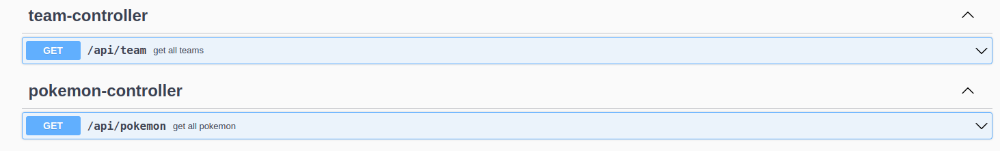

## KBE - Warehouse

### description

This **SpringBoot** + **Maven** Project consists of a Restful API and a PostgresqlDB 
It uses **Java 17** and **Postgresql 3** 

#### running the project

You can build and start the project with Docker by running  `docker-compose up --build` in rootdir or use the Intellij
Configuration `dockerCompose`  

#### deploying the project

A heroku dyno is configured and all you have to do to deploy to prod is this: `git push heroku master` ( if youre logged
in to Heroku )

heroku domain is: kbe-warehouse.herokuapp.com

#### API docs

